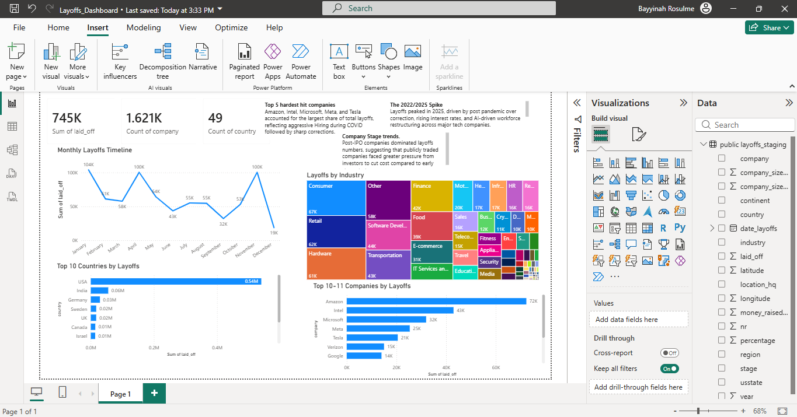

## Tech Layoffs Analysis (2020–2025)

Interactive Power BI dashboard and SQL analysis of 3,000+ tech company 
layoff records from 2020 to 2025.

## Tools Used
- PostgreSQL — Data cleaning and exploratory analysis
- Power BI — Interactive dashboard
- GitHub — Version control

## Dashboard Screenshot

## Key Findings
- 2025 was the worst year for layoffs
- USA, India, Germany, Sweden and UK were the most affected countries
- Amazon, Intel, Microsoft, Meta and Tesla had the highest layoffs
- Consumer and Retail were the hardest hit industries

## Files
- layoffs_cleaning.sql — Data cleaning scripts
- layoffs_analysis.sql — Exploratory analysis queries
- Layoffs_Dashboard.pbix — Power BI dashboard file
- dashboard_screenshot.png — Dashboard preview

## Resume Bullet
"Cleaned and analyzed 3,000+ tech layoff records in SQL using CTEs and 
window functions; built a Power BI dashboard revealing that 2025 had the 
highest layoffs concentrated in Consumer and Retail sectors."
